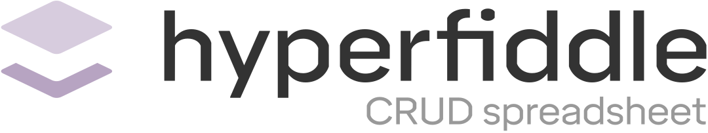

# Hyperfiddle – a high fidelity enterprise frontend for any service, function or object

For production support teams at operationally heavy businesses, Hyperfiddle is a **programmable object navigator** that lets you build custom internal frontend GUIs for your pre-existing enterprise backend services. Rapidly build powerful UIs that **directly call functions in your backend** through direct classpath linking, without writing any REST APIs.

Stop treating your ops teams badly due to eng resource constraints, as the beating heart of the business they should be your primary customer. Deliver **premium quality internal frontends faster**, without needing specialist frontend framework expertise. Hyperfiddle produces scalable, enterprise-class frontends, that are deeply customizable, robust, reliable and secure.

<!--  -->
<!-- [Demo video](https://github.com/user-attachments/assets/56eb30c5-e6cf-4f70-b005-d82e5d6820df) -->

## Example app: Datomic prod support tool

Hyperfiddle does NOT depend on Datomic. This Datomic example is a *userland* Hyperfiddle app! Datomic-browser project repo: https://github.com/hyperfiddle/datomic-browser`

Hyperfiddle features:
* a UI for any backend function through direct classpath linking
* prod-ready, built on standard web technologies
* queries are function calls, function calls are URL addressable
* enterprise functions/objects reachable through direct classpath linking (no REST APIS) 
* streamlined navigator UX with table-pickers and powerful grids
* programmable framework, not just a static developer tool
* programmable queries, user controls all queries (direct classpath linking)
* programmable grids, forms, hyperlinks and routing through declarative hypermedia DSL
* same security model as production web apps
* full progressive enhancement with web technologies (HTML, CSS, frontend, backend)
* State distribution powered by [Electric Clojure and the Electric protocol](https://github.com/hyperfiddle/electric)
* **NO REST APIs.** Never write an internal tool REST API ever again!

## Direct classpath linking to integrate any function, data source or native object

* **Not just Datomic:** navigate SQL or any backend data source via classpath function calls
* **Not just databases:** navigate clojure namespaces, file system, internal service state – literally any object
* **Not just Clojure:** call Java functions via classpath linking
* **Not just "data":** navigate **actual Java objects** via method call navigation (!)

**FAQ: What's the difference between an object navigator and a data browser?** Hyperfiddle is about objects, not data. Objects come with functions and methods, they aren't serializable, you navigate hyperlink graph structures rather than browse freeform nested structures, and you want to do this without impedance, using the actual native object datatype, not data mappers and derived projections. Objects are what the world is made of. And Hyperfiddle is how you reach them.

## Progressive enhancement to customize the object navigator core with web technologies

Technically this is a Electric v2 app using prerelease Hyperfiddle primitives from last year, we still need to upgrade it to latest. But you can see where we are going with this.

<!--

## Live demos:

* [simple jGit object navigator](https://electric.hyperfiddle.net/dustingetz.object-browser-demo3!ObjectBrowserDemo3/(dustingetz.datafy-git2!load-repo,'.!.git'))
* [clojure namespace and var directory](https://electric.hyperfiddle.net/dustingetz.object-browser-demo3!ObjectBrowserDemo3/(dustingetz.object-browser-demo3!clojure-all-ns))
* SQL browser (todo host demo)
* [jvm process thread inspector](https://electric.hyperfiddle.net/dustingetz.object-browser-demo3!ObjectBrowserDemo3/(dustingetz.object-browser-demo3!thread-mx))
* [java class inspector](https://electric.hyperfiddle.net/dustingetz.object-browser-demo3!ObjectBrowserDemo3/(dustingetz.object-browser-demo3!class-view,java.lang.management.ThreadMXBean))
* [file/folder explorer](https://electric.hyperfiddle.net/dustingetz.object-browser-demo3!ObjectBrowserDemo3/(clojure.java.io!file,'.!'))
* jar file viewer

-->

## A foundation for next-gen enterprise apps

Use this foundation to build scalable, enterprise-class frontends that are deeply customizable, robust and secure.

* (coming soon) hypermedia DSL: links, forms, buttons
* (coming soon) editable enterprise datagrids
* (coming soon) enterprise forms, pickers, wizards
* (coming soon) CQRS command/query architecture
* (coming soon) microservice classpath connectors
* (coming soon) audit and log all server effects and classpath interop
* (coming soon) enterprise security middleware
* (coming soon) Python classpaths

Use cases: enterprise workbench apps, customer support tools, microservice internal state observability and debugging tools, internal control plane apps, interactive dashboards.

**FAQ: Does it have AI?** Yes, we are starting to experiment with agents and it's going to be every bit as amazing as you imagine.

## Where are we going with this

"Hyper" means interconnected. "Fiddle" means play. Our vision for Hyperfiddle is to develop an **end-user hypermedia programming environment** that reaches all of your at-work cloud objects without writing network glue code. Our mission is to **collapse to zero** the cost of business process frontend development, for a huge range of apps from enterprise applications to throwaway tools.

Technical goals:
* identify and label the common structure shared between spreadsheets and CRUD apps
* in a credible, enterprise-compatible way that scales to more sophisticated apps, not less
* leverage this structure as the foundation for a next-gen application framework or engine (think Unity for enterprise apps)
* a foundation for end user programming as a higher order, creative medium
* zero-code data connectivity via the Electric protocol (c.f. Netscape and HTTP -- Netscape is the original declarative IO runtime for HTML apps)
* **never write a REST integration ever again**

Economically, Hyperfiddle is an ongoing, decade-long R&D investment to find and develop a market, economic model, and global at-scale distribution strategy which is directly and immediately aligned with investing the proceeds into foundational programming abstractions, so that we can all benefit from better software, and build it less painfully.

## What does the code look like?

See this example gist: [Clojure namespace browser in Hyperfiddle — gist](https://gist.github.com/dustingetz/b2a7a5a7af0feed17de5eb73e0444e28)

## Getting Started

> [!NOTE]
> Hyperfiddle is now in technical preview! Request preview access here: https://www.hyperfiddle.net/early-access.html and then DM @dustingetz to schedule a demo.

## License
* free for individual use on local dev machines, mandatory runtime login (we are a business)
* using in prod requires a license, contact us.
* still working out the details

## Social media

* https://x.com/dustingetz

# Program your business, without drowning in complexity

